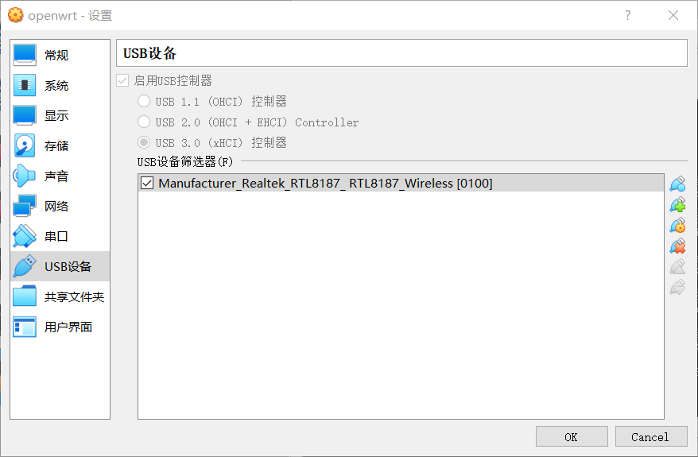
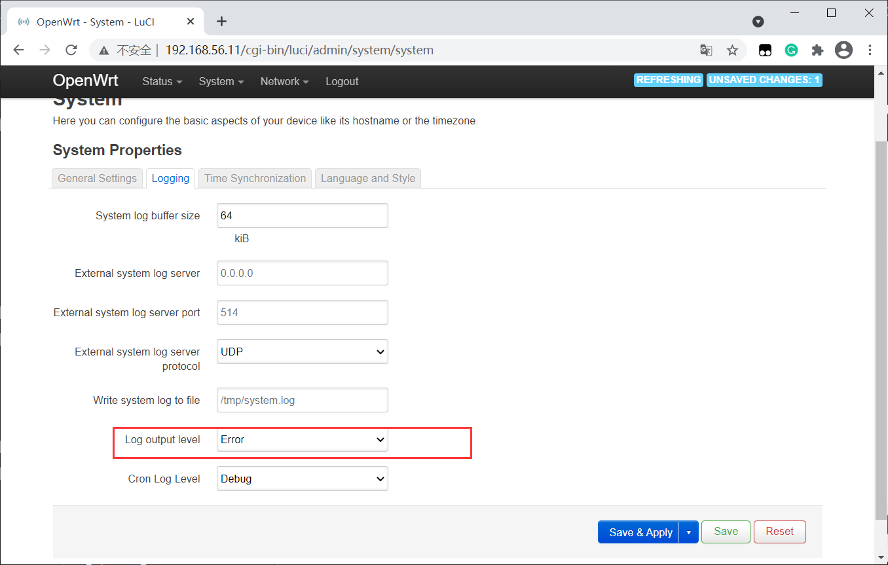

# 第一章 VirtualBox的配置与使用

## 实验目的

- 熟悉基于 OpenWrt 的无线接入点（AP）配置
- 为第二章、第三章和第四章实验准备好「无线软 AP」环境


## 实验环境

- 可以开启监听模式、AP 模式和数据帧注入功能的 USB 无线网卡
- Virtualbox

## 实验要求

- 对照 `无线路由器/无线接入点（AP）配置` 列的功能清单，找到在 OpenWrt 中的配置界面并截图证明；
- 记录环境搭建步骤；
- 如果 USB 无线网卡能在 `OpenWrt` 中正常工作，则截图证明；
- 如果 USB 无线网卡不能在 `OpenWrt` 中正常工作，截图并分析可能的故障原因并给出可能的解决方法。

## 实验过程
### OpenWrt on VirtualBox环境搭建
- 在`https://downloads.openwrt.org/releases/19.07.5/targets/x86/64/`中下载`openwrt-19.07.5-x86-64-combined-squashfs.img.gz`。

  

- 使用`gzip -d`在`git bash`中解压缩刚下载的文件。

  

- 对`img`文件进行`dd`操作

  

- 在虚拟机默认文件夹使用 `VBoxManage convertfromraw --format VDI openwrt-x86-64-combined-squashfs.img openwrt-x86-64-combined-squashfs.vdi`命令将`img`文件转换成`vdi`文件。

  
  

- 在`virtualBox`中新建虚拟机，并选择[使用已有虚拟硬盘]，并注册刚才生成的`vdi`。得到新的虚拟机`openwrt`。

  ​	

- 虚拟机安装成功，将第一块网卡设置为：Intel PRO/1000 MT 桌面（仅主机(Host-Only)网络）；第二块网卡设置为：Intel PRO/1000 MT 桌面（网络地址转换(NAT)）

    

- 启动虚拟机

    

- 修改`/etc/config/network`

   

- 修改完成后重新加载指定网卡

    ```bash
    # 网卡重新加载使配置生效
    ifdown eth0 && ifup eth0
    # 查看网卡
    ip a
    ```

    

- 安装`LuCi`

  ```
  # 更新 opkg 本地缓存
  opkg update
  
  # 检索指定软件包
  opkg find luci
  # luci - git-19.223.33685-f929298-1
  
  # 查看 luci 依赖的软件包有哪些 
  opkg depends luci
  # luci depends on:
  #     libc
  #     uhttpd
  #     uhttpd-mod-ubus
  #     luci-mod-admin-full
  #     luci-theme-bootstrap
  #     luci-app-firewall
  #     luci-proto-ppp
  #     libiwinfo-lua
  #     luci-proto-ipv6
  
  # 查看系统中已安装软件包
  opkg list-installed
  
  # 安装 luci
  opkg install luci
  
  # 查看 luci-mod-admin-full 在系统上释放的文件有哪些
  opkg files luci-mod-admin-full
  # Package luci-mod-admin-full (git-16.018.33482-3201903-1) is installed on root and has the following files:
  # /usr/lib/lua/luci/view/admin_network/wifi_status.htm
  # /usr/lib/lua/luci/view/admin_system/packages.htm
  # /usr/lib/lua/luci/model/cbi/admin_status/processes.lua
  # /www/luci-static/resources/wireless.svg
  # /usr/lib/lua/luci/model/cbi/admin_system/system.
  # ...
  # /usr/lib/lua/luci/view/admin_network/iface_status.htm
  # /usr/lib/lua/luci/view/admin_uci/revert.htm
  # /usr/lib/lua/luci/model/cbi/admin_network/proto_ahcp.lua
  # /usr/lib/lua/luci/view/admin_uci/changelog.htm
  ```

- 安装完`LuCi`后浏览器访问的结果

  

### 无线网卡配置
- 插入USB无线网卡，检测下述命令：`iw dev`,`iw phy`,`lsusb`

- `usb`端口设置：

  


- 检测虚拟机是否可以正常的识别网卡。

  

### 开启 AP 功能

- 当前待接入 USB 无线网卡的芯片信息可以通过在 Kali 虚拟机中使用 `lsusb` 的方式查看，但默认情况下 OpenWrt 并没有安装对应的软件包，需要通过如下 `opkg` 命令完成软件安装。

    ```bash
    # 每次重启 OpenWRT 之后，安装软件包或使用搜索命令之前均需要执行一次 opkg update
    opkg update && opkg install usbutils
    ```

    


- 安装好 `usbutils` 之后，通过以下 2 个步骤可以确定该无线网卡的驱动是否已经安装好。

    ```bash
    # 查看 USB 外设的标识信息
    lsusb
    # 查看 USB 外设的驱动加载情况
    lsusb -t

    # 若驱动未加载，则下载驱动
    # opkg find 命令可以快速查找可能包含指定芯片名称的驱动程序包
    opkg find kmod-* | grep 2870
    # 下载对应驱动
    opkg install kmod-rt2800-usb
    ```

    

- 驱动安装成功

    

- 默认情况下，OpenWrt 只支持 `WEP` 系列过时的无线安全机制。为了让 OpenWrt 支持 `WPA` 系列更安全的无线安全机制，还需要额外安装 2 个软件包：`wpa-supplicant` 和 `hostapd` 。其中 `wpa-supplicant` 提供 WPA 客户端认证，`hostapd` 提供 AP 或 ad-hoc 模式的 WPA 认证。

    ```bash
    opkg install hostapd wpa-supplicant
    ```

- 成功加载网卡驱动后，登入 `LuCi` 之后在顶部菜单 `Network` 里即可发现新增了一个菜单项 `Wireless`

    

- 按试验要求对配置进行修改，但发现operating frequecy 没有模式选择，编译保存之后报错为  `wireless is not associated`

    
    

- 【经过询问得知Realtek RTL8187网卡不支持AP模式】，换用rt2800网卡重新安装驱动

    


- 手工指定监听信道和信号强度，配置成功。
    
    
    

  
## `OpenWrt`使用

### 无线路由器/无线接入点（AP）配置

- 重置和恢复AP到出厂默认设置状态

  
 

- 设置AP的密码
  

- 勾选详情配置中的`Hide ESSID`设置SSID广播和非广播模式

  

- 配置不同的加密方式

 

  
- 配置无线路由器使用自定义的DNS解析服务器

  

- 配置DHCP和禁用DHCP

  

  


- 开启路由器/AP的日志记录功能

  

- 配置AP隔离(WLAN划分)功能

  

- 设置MAC地址过滤规则。

  

- 查看AP/无线路由器支持哪些工作模式

 

- 使用手机连接

  

## 参考资料

[黄老师课件](https://c4pr1c3.github.io/cuc-mis/chap0x01/exp.html)