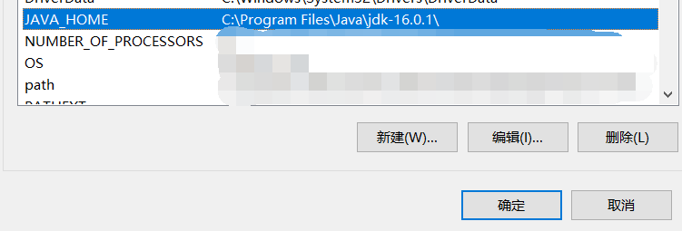
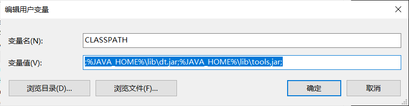
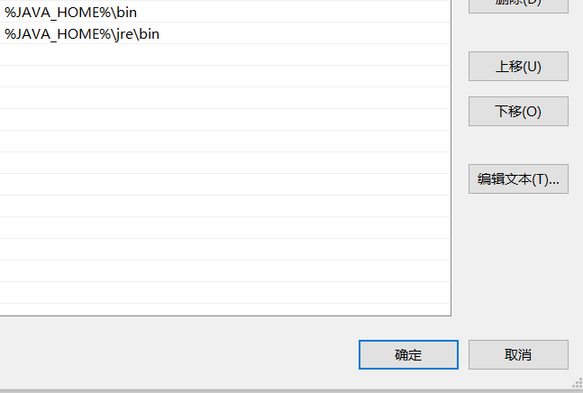
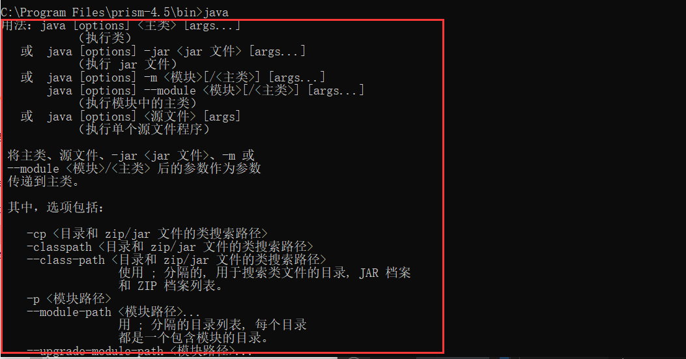
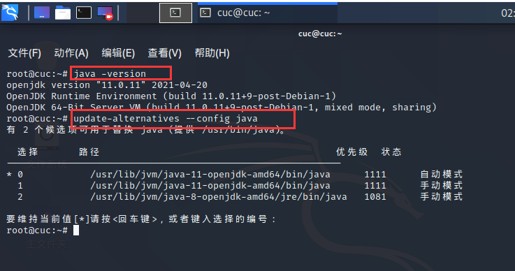
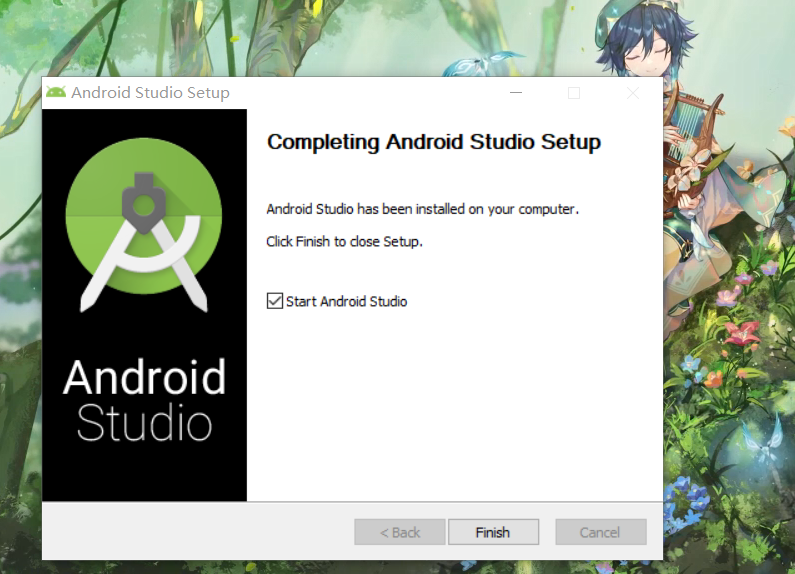
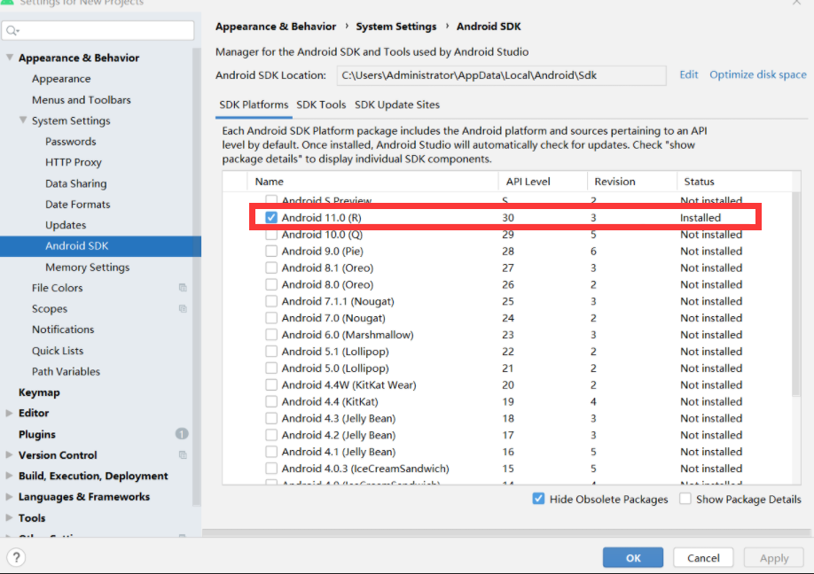
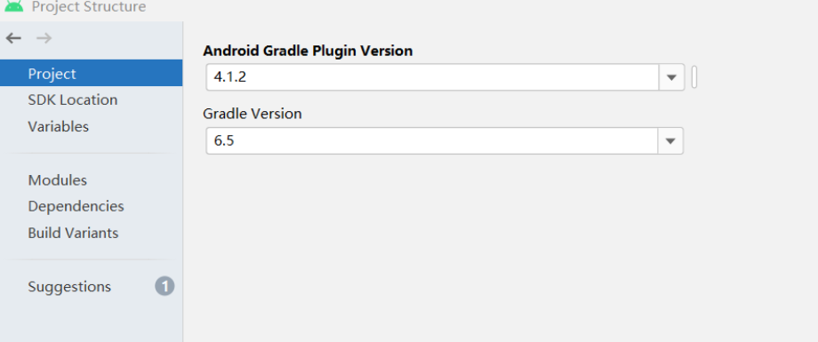

# 第五章 Android模拟器环境搭建

## 实验要求

- [x] 安装和配置 Java SDK
- [x] 安装Android Studio
- [x] 下载安装 Android SDK
- [x] 配置 Android 模拟器运行环境
- [x] 配置 Gradle 编译环境

## 实验环境

- Windows 10
- Kali 
- Java SE Development Kit 11
- Android Studio 


## 实验过程
### Java SDK的安装与配置
#### windows
- 下载并安装Java JDK 
- [[Download Link]](https://www.oracle.com/java/technologies/javase-jdk11-downloads.html)

- 配置环境变量
    - 右键单击`此电脑` -> `属性` -> `高级系统设置` -> `环境变量`
    - 新建JAVA_HOME变量，添加电脑上JDK安装的绝对路径
    
    

    - 新建/修改 CLASSPATH 变量，添加变量如下

    

    - 向PATH中添加变量如下
    

    - 检验安装是否成功
    
#### kali
    ```cmd
    $ apt-get update && apt-get upgrade
    ## 安装Java JDK
     $ apt-get install default-jdk -y
    ## 确认Java版本
    $ java -version
    ## 查看Java JDK的安装位置
    update-alternatives --config java
    ## 添加环境变量
    $ vim /etc/environment
    PATH="/usr/local/sbin:/usr/local/bin:/usr/sbin:/usr/bin:/sbin:/bin:/usr/games:/usr/local/games:/usr/lib/jvm/jdk-11.0.10/bin"
    JAVA_HOME="/usr/lib/jvm/jdk-11.0.10"
    ```

  


### Android Studio 的安装与配置 
- 下载Android Studio并安装
- [Android Studio](http://www.android-studio.org/)  

  

- 启动 Android Studio，默认安装 SDK 版本为 Android 11.0 (R)，后期可根据需要手动下载其他版本 

  

  
- 在`SDK Tools`界面下载安装`Intel x86 Emulator Accelerator (HAXM installer)`  

  

-  Android Studio Gradle 插件版本  

  

## 问题及解决  

1.国外官网下载Android Studio期间频繁发生网络中断
- 改为镜像下载[Android Studio](https://developer.android.google.cn/studio#downloads)  


## 参考资料

[黄老师课件](https://c4pr1c3.github.io/cuc-mis/chap0x05)


