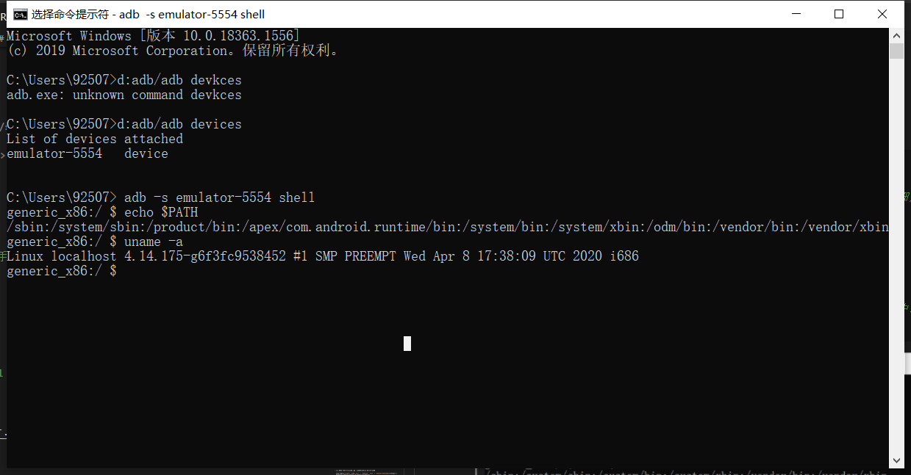

# Android 缺陷应用漏洞攻击实验

## 实验目的

* 理解 Android 经典的组件安全和数据安全相关代码缺陷原理和漏洞利用方法；  
* 掌握 Android 模拟器运行环境搭建和 ADB 使用；  

## 实验环境

* [Android-InsecureBankv2](https://github.com/c4pr1c3/Android-InsecureBankv2)  
* Android Studio
* WIndows10

## 实验要求

* 详细记录实验环境搭建过程；  
* 至少完成以下实验 ：  
  * [x] Developer Backdoor  
  * [x] Insecure Logging  
  * [x] Android Application patching + Weak Auth  
  * [x] Exploiting Android Broadcast Receivers  
  * [x] Exploiting Android Content Provider  
* （可选）使用不同于 Walkthroughs 中提供的工具或方法达到相同的漏洞利用攻击效果；  
  * 推荐 drozer  

## 实验过程
### 实验环境搭建
#### python2.7
- 下载[python2.7.18](https://www.python.org/ftp/python/2.7.18/python-2.7.18.msi)并安装

- 添加环境变量`path`：`C:\Python27;C:\Python27\Scripts;`并将这两条移动到最上面，然后在命令行使用`python`和`pip`命令时默认是`2.7`版本。

    

- 检测是否安装成功

    

#### 安装仓库以及相关软件

- 下载最新仓库到本地`git clone https://github.com/c4pr1c3/Android-InsecureBankv2.git`


- 安装必备软件`pip install install -r requirtements.txt`

    

    

- 运行服务器：`python app.py`   

    

#### 配置adb
- 下载[abs](http://adbshell.com/upload/adb.zip)并解压到指定文件夹

- 添加环境变量`path`：`D:\adb`

- 检测是否安装成功

  

- 命令行连接模拟器

  ```bash
  # 查看开启的模拟器
  adb devices
  # 如果运行失败，提示没有adb命令，要手动将adb的路径加到环境变量中，详细见Q0
  
  # 连接模拟器终端
  adb -s emulator-5554 shell
  
  # 输出环境变量PATH
  echo $PATH
  
  # 查看当前系统版本（on Android 7.1.1 (Google APIs）x86_64 ，部分系统中没有提供 uname）
  uname -a
  ```

  

#### 安装 `InsecureBankv2.apk` 到 `AVD`

- 在avd启动状态下安装apk文件  

  

  

* 在AVD中找到`InsecureBankv2`程序，使用帐号`jack`密码`Jack@123$`或帐号`dinesh`密码`Dinesh@123$`  测试登录

  


### 实验要求解决
#### Developer Backdoor 
- 安装 [`JADX `]

  ```bash
  git clone https://github.com/skylot/jadx.git
  cd jadx
  gradlew.bat dist
  ```

  

 
 - 下载[dex2jar](https://sourceforge.net/projects/dex2jar/files/dex2jar-2.0.zip/download)解压缩

- 解压缩`InsecureBankv2.apk`,将`classes.dex`复制到`dex2jar`的目录中

   


- 使用下面的命令将`.dex`文件转换为`.jar`文件

   ```bash
   d2j-dex2jar.bat classes.dex
   ```
    

- 在jadx文件夹的`\build`中找到`jadx-GUI-dev`，用该程序打开`classes-dex2jar.jar` 

     


- 测试该漏洞导致当用户名为`devadmin`时，使用任何密码都可以登录

    

   

#### Insecure Logging


- 在模拟器上启动已安装的`InsecureBankv2`应用程序

-  登录并进行修改密码操作

   
  
- - 在命令行使用`adb logcat`查看日志，将输出到txt文件中

   

-  查看日志，发现登录及修改密码的信息均以明文存储

   
   

#### Android Application patching + Weak Auth


- 利用`VScode`中的`APKLab`扩展。根据[APKLab](https://my.oschina.net/tavenli/blog/4889086)直接生成
-  在`VScode`中使用`CTRL+SHIFT+P`打开`APKLab`  
- 打开`APK`文件，找到`\res\value\strings.xml` 找到相应位置，将`no`修改成`yes`  
- 右键点击列表最下方`apktool.yml`重打包生成新文件  

    

- 重新安装，发现界面中新增`创建账户`的按钮  

    

#### Exploiting Android Broadcast Receivers
- 下载并安装apktool

  - 下载apktool jar包将其重命名为”apktool.jar“放在任意文件夹内 
  - 将开发者提供的一段启动脚本（windows下）保存为”apktool.bat“放在同一文件夹下：
  ```bash
  @echo off
  set PATH=%CD%;%PATH%;
  java -jar -Duser.language=en "%~dp0\apktool.jar" %1 %2 %3 %4 %5 %6 %7 %8 %9
  ```

  - 将该文件夹加入环境变量PATH里。 

  - 打开cmd，输入apktool ，出现命令提示，安装成功。

     

- `apktool d InsecureBankv2.apk`进行反编译 

-  在文件中找到`AndroidManifest.xml`文件并打开  

    

- 在`AndroidManifest.xml`中找到该行

    

- 在jadx文件夹的`\build`中找到`jadx-GUI`，用该程序打开`classes-dex2jar.jar`，在`MyBroadCastReceiver`中找到该行  

    

- 在命令行中打开`adb shell`

-  输入下面的命令（绕过登录直接修改密码）

    ```bash
    am broadcast -a theBroadcast -n com.android.insecurebankv2/com.android.insecurebankv2.MyBroadCastReceiver --es phonenumber 5554 --es newpass Dinesh@123!
    ```

    

-  avd中收到回复 修改成功

    

#### Exploiting Android Content Provider

- `apktool d InsecureBankv2.apk`进行反编译 

-  在文件中找到`AndroidManifest.xml`文件并打开  

- 在`AndroidManifest.xml`中找到该行

    


- 在jadx文件夹的`\build`中找到`jadx-GUI`，用该程序打开`classes-dex2jar.jar`，在`MyBroadCastReceiver`中找到该行  

    

-  输入`adb shell`进入`adb命令行`

- 输入下命令

    ```bash
    content query --uri content://com.android.insecurebankv2.TrackUserContentProvider/trackerusers
    ```
  发现登录记录`id= , name= `以明文的方式记录在设备上

    


## 遇到的问题及解决

1.python2.7无法正常启动，启动程序为python3.8
- 将环境移动到最上面，然后在命令行使用`python`和`pip`命令时默认是`2.7`版本。 

2.`python app.py`运行过程中多次报错，无运行库
- 将错误信息中所需库依次下载

 

 

 3.使用code反编译工具时出现卡顿，无法正常运行的错误
 - 下载apktool工具，进行反编译工作

## 参考资料

- [课本](https://c4pr1c3.github.io/cuc-mis/chap0x08/exp.html)

- [课件](https://c4pr1c3.github.io/cuc-mis-ppt/chap0x08.md.html)

- [APKLab](https://my.oschina.net/tavenli/blog/4889086)

- [移动互联网安全](https://www.bilibili.com/video/BV1rr4y1A7nz?from=search&
